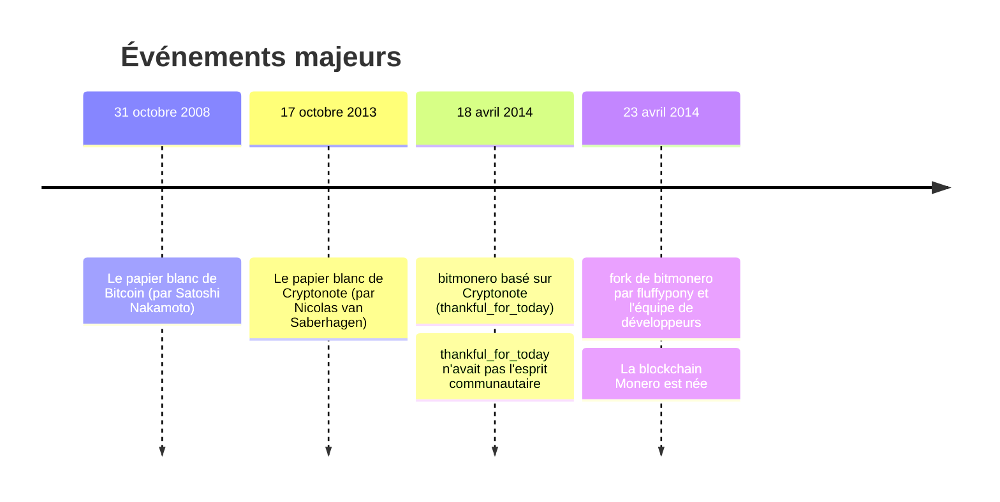
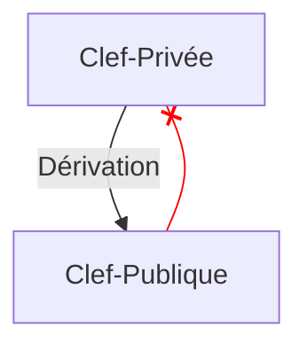

+++
title = "Le pouvoir des mathématiques : une plongée dans Monero"
date = 2023-11-26T17:57:56+01:00
author = "Mijux"
keywords = ["math", "blockchain", "privacy", "security","monero"]
summary = "Monero, la blockchain respectueuse de la vie privée"
pin = true
draft = false
math = true 
+++

# Le pouvoir des mathématiques : une plongée dans Monero

> Clause de non-responsabilité : Cet article ne consiste pas en un conseil financier, et n'est pas destiné à inciter à l'utilisation de la blockchain Monero ainsi ni à l'achat de son token XMR. Veuillez consulter la législation en vigeur dans votre pays. Selon les lois et réglementations, il peut être considéré illégal de détenir du Monero, ou d'utiliser son écosystème.

## Introduction

Cet article n'a pas pour vocation de vous expliquer comment utiliser la blockchain Monero, comment acheter du XMR ou encore comment installer un wallet. Vous trouverez des tutoriels très certainement intéressants en vous munissant de votre navigateur et moteur de recherche préférés.

## Glossaire

- **Monero** : La blockchain open-source Monero axée sur la vie privée et la décentralisation. Dans cet article le terme Monero sera designera la blockchain.
- **token XMR** : Le symbole de la monnaie Monero. Ce terme sera utilisé pour décrire l'actif monétaire.

## Pourquoi Monero ?

Ces dernières années, Monero, a souvent été assimilée comme la cryptomonnaie à destination des pirates informatiques et des hackers. Du fait de ses protections et de ses particularités sur le respect de la vie privée, Monero est un écosystème très prisé des hackers mais aussi plus simplement des personnes qui souhaitent ne pas être tracées.

Depuis ses débuts, Monero n'a jamais eu vocation à inciter le cybercrime, l'une de ses convictions est de proposer une alternative au cash. Vous pouvez penser que c'est un peu étrange car notre cash est physique, tangible du bout de nos doigts, alors que le Monero est un actif cryptographique virtuel. Alors oui, avec Monero vous ne pourrez pas nager dans une mer de pièces comme notre ami Picsou...

Le plus simple, me semble-t'il est de définir ce qu'est le cash, non par son utilisation mais par ses propriétés. Quelles sont alors ses propriétés ? Je vais essayer de les définir avec vous.
1. être **fongible** : la liquidité peut être mesurée, être comptée et être échangée contre d'autres biens.
2. être **sécurisé** : on peut avoir confiance dans le système.
3. être **privé** : avec le cash, seules les entités concernées par le paiement sont au courant de la transaction.
4. être **extensible** (scalable) : le fait d'avoir une ou des milliers de transactions n'affecte pas le système. 

Monero possédant les mêmes propriétés, est donc une alternative sérieuse à l'argent liquide. Il ne s'inscrit pas dans une volonté de remplacer l'entièreté du système bancaire.

Aujourd'hui l'ensemble de nos transactions bancaires sont tracées, enregistrées, utilisées. De nombreuses personnes n'y prêtent que peu d'intérêt. Vous avez sûrement été confrontés aux personnes avec ce type de discours :
- "je n'ai rien à cacher alors cela m'importe peu que mes données soient utilisées",
- "cela m'importe peu que ma banque sache ce que j'achète",
- ou d'un ton plus accusateur : "as-tu des choses à cacher ?"

Cela me fait beaucoup penser à Edward Snowden qui avait dit ceci :
> Dire que votre droit à la vie privée importe peu car vous n'avez rien à cacher revient à dire que votre liberté d'expression importe peu, car vous n'avez rien à dire

Monero met en avant la "privacy" qu'on traduit en français par "vie privée". C'est le fait de laisser la capacité à chacun de choisir comment gérer ses informations personnelles : à qui révéler, quand et quoi. La vie privée, c'est par exemple le fait que je puisse choisir les personnes à qui je révèle l'endroit où j'habite et ce, quand je le souhaite. Cela paraît trivial, mais il me parait peu probable que vous iriez dire à un inconnu dans la rue l'adresse où vous habitez. Au niveau monétaire, l'argent liquide respecte votre vie privée (en omettant les billets numérotés).

## Un peu d'histoire

Un petite et simple contextualisation historique de la blockchain Monero dans son environemment, le but n'étant pas de vous détailler l'ensemble des mises à jour de Monero.

## La cryptographie au cœur de Monero

Monero base l'ensemble de sa sécurité par la preuve mathématique, vous n'avez pas besoin de faire confiance à qui que ce soit, seulement aux preuves mathématiques qui sont utilisées pour sécuriser la blockchain ! La blockchain est publique, dans la mesure où vous pouvez lire les transactions, pourtant vous ne pourrez pas connaître l'émetteur, le destinateur et le montant de la transaction !

### ECC

Monero utilise la cryptographie asymétrique, c'est-à-dire une utilisation d'une clef privée et d'une clef publique. Dans le cas de la blockchain Monero, cette cryptographie utilise la notion de courbes elliptiques aussi nommée **Elliptic Curve Cryptography** (ECC) en anglais. 

Une courbe elliptique est définie par la fonction suivante :
$$
y^2 = x^3 + ax + b
$$

Visuellement, les courbes elliptiques ont une forme ressemblante à l'image ci-dessous :

### Clef privée
 
Vous avez une clef privée racine qui est générée de manière aléatoire. **Toutes vos autres clefs privées sont dérivées de manière déterministe**, dans d'autres termes, seule votre clef privée racine importe, les autres peuvent être récupérées par opérations mathématiques. Cette clef racine doit rester secrète (à ne pas mettre dans votre bloc note de téléphone par exemple).
 
Cette clef privée fait 256 bits de longueur et est un point sur la courbe elliptique. Monero utilise la courbe elliptique *edwards25519* où le scalaire maximum autorisé est de l'ordre de \\(2^{252}\\). La force de la clef est donc de 252 bits au lieux de 256. Il se trouve que ce choix se place pour respecter la norme communautaire mais n'est pas préoccupante pour la suite des opérations.

### Clef publique

La clef publique est aussi dérivée de manière déterministe à partir de la clef privée. Le principe de la clef publique c'est qu'elle puisse être... publique, donc lorsque l'implémentation est correctement faite, il n'est pas possible de passer de la clef publique à la clef privée !

Alors comment effectuer cette dérivation ? Voici l'équation pour obtenir une clef publique à partir d'une clef privée ! 
- Soit \\(P\\) la clef publique
- Soit \\(x\\) la clef privée
- Soit 	\\(G\\) une constante spécifique à la courbe *edwards25519* qui est un point de la courbe
$$
P = xG
$$

Et c'est *tout*, la clef publique est le point \\(G\\) multiplié par \\(x\\) la clef privée. Le résultat est aussi un point sur la courbe, c'est l'une des propriétés des courbes elliptiques. De plus, dans le monde des courbes elliptiques, il n'est pas possible de retrouver \\(x\\) à partir \\(P\\) et \\(G\\). Nous faisons face au problème du logarithme discret !

### Paires de clefs

Sur le système Monero, vous avez plusieurs paires de clefs privées/publiques. Elles sont appelées "Spend keys" et "View keys", comme leur nom l'indique, une paire est utilisée pour envoyer des Moneros et l'autre est utilisée pour voir quelles sont les transactions à votre destination.

## Sécurité Monero

Les parties suivantes traitent les mathématiques utilisés dans Monero. Le détail des démonstrations n'y sera pas expliqué mais vous y verrez les équations et propriétés mathématiques qui découlent de ces démonstrations. Cette partie est consacrée à comprendre comment la blockchain Monero protège les informations de ses utilisateurs.

Nous allons traiter ici des trois principaux aspects de sécurités apportés par la blockchain Monero. A savoir : 
- Stealth Address (Adresses Furtives)
- Ring Signature (Signature de Cercle)
- Ring CT - Ring Confidential Transactions (Transactions Confidentielles de Cercle)

| ↙ |Stealth Address|Ring Signature|Ring CT|
| ---:|:--------------|:-------------|:------|
|Protège|Le destinataire|L'émetteur|Le montant|

Pour les explications nous allons prendre Greg et Lola (cela change de Bob et Alice), Greg est l'émetteur et Lola la destinataire.

### Définitions

Dans un premier temps, pour permettre la bonne compréhension des équations mathématiques, il est nécessaire vous donner les paramètres.

#### Paramètres

\\(q\\) : Un nombre premier; \\(q = 2^{255} - 19\\)

\\(d\\) : Un élément de \\(\Bbb{F}_q\\); \\(d = -121665/121666\\)

\\(E\\) : L'équation d'une courbe elliptique; \\(-x^2 + y^2 = 1 + dx^2y^2\\)

\\(G\\) : Le point de base; \\(G = (x, -4/5)\\)

\\(l\\) : Un ordre premier du point de base; \\(l = 2^{252} + 2774231...493\\) [\\(_i\\)](https://monerodocs.org/cryptography/asymmetric/edwards25519/#prime-order-of-the-base-point-l)

\\(H_s\\) : Une fonction de hashage cryptographique; \\(\\{0,1\\}^* \rightarrow \Bbb{F}_q\\)

\\(H_p\\) : Une fonction de hashage déterministe \\(E(\Bbb{F}_q) \rightarrow E(\Bbb{F}_q)\\)

Nos paramètres d'équation maintenant définis, il reste quelques termes à définir pour s'assurer de parler des même éléments.

#### Terminologie

- **clef privée elliptique** est une clef privée elliptique standard : un nombre \\(a \in [1, l-1]\\)
- **clef publique elliptique** est une clef publique elliptique standard : un point \\(A = aG\\)
- **paire de clef à utilisation unique** est une paire de clefs privée et publique elliptique
- **clef privée utilisateur** est une paire \\((a,b)\\) de deux clefs privées elliptiques
- **clef de suivi** est une paire \\((a,B)\\) d'une clef privée et publique elliptique où \\(B = bG\\) et \\(a \neq b\\)
- **clef publique utilisateur** est une paire \\((A,B)\\) de deux clefs publiques elliptiques dérivées de \\((a,b)\\)
- **adresse standard** est une représentation d'une clef publique utilisateur donnée en une chaîne de caractères avec correction d'erreurs
- **adresse tronquée** est une représentation de la seconde moitié (point B) d'une clef publique d'utilisateur donnée en une chaîne de caractères avec correction d'erreurs.

### Stealth Address

Voici les étapes pour une transaction entre Greg et Lola.

#### Etape 1

Greg veut envoyer des XMR à Lola. Cette dernière a publié son adresse standard. Greg déballe (unpack) l'adresse et récupère l'adresse publique de Lola \\((A,B)\\).

#### Etape 2

Greg génère un nombre aléatoire \\(r\\) dans \\([1, l-1]\\) et calcule la clef publique à usage unique.

$$
P = H_s(rA)G + B
$$

#### Etape 3

Greg utilise alors la clef publique \\(P\\) en tant que clef de destination pour la sortie. De plus, il calcule \\(R\\) qu'il met dans la transaction.

$$
R = rG
$$

Nous pouvons noter que Greg peut créer d'autres sorties avec des clefs publiques uniques : Les clefs des destinataires \\((A_i,B_i)\\) impliquent des \\(P_i\\) différents même avec le même \\(r\\).

#### Etape 4

Greg envoie les XMR. 

#### Etape 5

Lola vérifie toutes les transactions avec sa clef privée \\((a,b)\\), et calcule le \\(P'\\) suivant :

$$
P' = H_s(aR)G + B
$$

Si la transaction de Greg pour Lola est parmi les transactions vérifiées, alors :

$$
aR = arG = rA \\\
et \\\
P' = P
$$

#### Etape 6

Lola peut retrouver la clef privée à usage unique \\(x\\) :

$$
x = H_s(aR) + b \\\
donc \\\
P = xG
$$

Cela lui permet donc d'envoyer à son tour les tokens XMR qu'elle a reçus. Ce procédé mathématique protège le destinateur. Personne, excepté Lola, ne peut déterminer quels sont les virements destinés vers son portefeuille virtuel (wallet).

### Ring Signature

L'autre particuliarité intéressante, de Monero et de son protocole Cryptonote, est la faculté de pouvoir cacher l'émetteur d'une transaction. Une signature en cercle à usage unique (ou appelé en anglais one-time ring signature) containt quatre algorithmes :
- **GEN**: Prend les paramètres publiques et produit une paire de clefs \\((P,x)\\) et une clef publique \\(I\\).
- **SIG**: Prend un message \\(m\\), un ensemble \\(S'\\) de clefs publiques \\(\\{P_i\\}_{i \neq s}\\), une paire \\((P_s, x_s)\\) et produit une signature \\(\sigma\\) et un ensemble \\(S = S' \cup \\{P_s\\}\\)
- **VER**: Prend un message \\(m\\), un ensemble \\(S\\), une signature \\(\sigma\\) et produit "vrai" ou "faux".
- **LNK**: Prend un ensemble \\(\mathcal{I} = \\{I_i\\}\\), une signature \\(\sigma\\) et produit "lié" ou "indépendant".

L'idée du protocole est assez simple : un utilisateur produit une signature qui peut être vérifiée par un ensemble de clefs publiques plutôt que par une clef publique unique. L'identité du signataire est indiscernable des autres utilisateurs dont les clefs publiques font partie de l'ensemble.

#### GEN

Le signataire génère un nombre aléatoire secret \\(x \in [1, l-1]\\) et calcule la clef publique correspondante \\(P = xG\\). Il en calcule une autre \\(I = xH_p(P)\\). Cette clef \\(I\\) est appelée "la clef image".

#### SIG

Le signataire génère une signature à usage unique avec une preuve à divulgation nulle de connaissance sans interaction aussi appelée en anglais **non-interactive zero-knowledge proof**. Cette génération est basée sur les travaux de Ronald Cramer, Ivan Damgard et Berry Schoenmakers : *Proofs of Partial Knowledge and Simplified Design of Witness Hiding Protocols*.

Ce signataire choisit donc un sous-ensemble aléatoire \\(S'\\) de \\(n\\) à partir des clefs publiques \\(P_i\\) des autres utilisateurs, de sa propre paire de clefs \\((x, P)\\) et de la clef image (générée à l'étape [GEN](#gen)).

Soit \\(0<=s<=n\\) l'indice du secret du signataire dans \\(S\\), sa clef publique est donc \\(P_s\\). Puis, le signataire génère des nombres aléatoires.
$$
 \\{q_i | i=0...n\\} \in (1...l) \\\
 \\{w_i | i=0...n, i \neq s \\} \in (1...l)
$$

Après avoir généré ces nombres aléatoires, il applique les transformations suivantes.

$$
L_i = \left\\{
    \begin{array}{ll}
        q_iG & si \: i = s \\\
        q_iG + w_iP_i & si \: i \neq s
    \end{array}
\right.
$$

$$
R_i = \left\\{
    \begin{array}{ll}
        q_iH_p(P_i) & si \: i = s \\\
        q_iH_p(P_i) + w_iI & si \: i \neq s
    \end{array}
\right.
$$

L'étape suivante est de récupérer le défi non-intéractif !

$$
c = H_s(m,L_1,...,L_n,R_1,...,R_n)
$$

Tout cela permettant au signataire de calculer la réponse :

$$
c_i = \left\\{
    \begin{array}{ll}
        w_i & si \: i \neq s \\\
        c - \displaystyle\sum_{i=0}^nc_i \mod l & si \: i = s
    \end{array}
\right.
$$

$$
r_i = \left\\{
    \begin{array}{ll}
        q_i & si \: i \neq s \\\
        q_s - c_sx \mod l & si \: i = s
    \end{array}
\right.
$$

La signature résultante est donc la suivante : 

$$
\sigma = (I, c_1,..., c_n, r_1,..., r_n)
$$

##### VER

Le vérifieur s'assure de la signature en appliquant les transformations inverses.
$$
\left\\{
    \begin{array}{ll}
        L'_i = r_iG + c_iP_i \\\
		R'_i = r_iH_p(P_i) + c_iI
    \end{array}
\right.
$$

Enfin, il vérifie l'égalité suivante :
$$
 \displaystyle\sum_{i=0}^nc_i = H_s(m,L'_0,...,L'_n,R'_0,...,R'_n) \mod l
$$

Si cette égalité est vérifiée alors le vérifieur peut passer à l'étape [LNK](#lnk) sinon il rejete la signature.

#### LNK

Le vérifieur regarde si la clef \\(I\\) a déjà été utilisée dans des signatures précédentes. Plusieurs utilisations impliquent que deux signatures ont été produites à partir de la même clef secrète. 

- En appliquant les L-transformations, le signataire prouve qu'il connait un \\(x\\) tel que \\(P_i = xG\\).
- Pour rendre cette preuve non-répétable, la clef image \\(I = xH_p(P)\\) est utilisée. Le signataire utilise les mêmes coefficients \\((r_i,c_i)\\) pour prouver une affirmation similaire : Il connait un \\(x\\) qui vérifie \\(H_p(P_i) = Ix^{-1}\\). 

Si le mappage \\(x \rightarrow I\\) est une injection alors :
- Personne ne peut récupérer la clef publique depuis la clef image ni identifier le signataire
- Le signataire ne peut pas fabriquer deux signatures avec différents \\(I\\) et avec le même \\(x\\)

Vous trouverez de nombreuses informations supplémentaires et détails dans les travaux de *Nicolas van Saberhagen* dans **CryptoNote v 2.0**.

### Ring CT

Le protocole Ring CT a été implémenté en janvier 2017 puis est devenu obligatoire après septembre 2017. Le protocole utilise la signature MLSAG (**Multilayered Linkable Spontaneous Anonymous Group**). Cette signature est similaire aux signatures LSAG (**Linkable Spontaneous Anonymous Group**, utilisé dans [Ring Signature](#ring-signature) mais au lieux d'avoir une signature en cercle sur un ensemble de \\(n\\) clefs, elle est basée sur un ensemble de \\(n\\) clefs vecteurs.

- **clef vecteur** : une collection de \\(\text{\\={y}} = (y_1, ... ,y_r)\\) de clefs publiques avec leur clef privée correspondante \\(\text{\\={x}} = (x_1, ..., x_r)\\)

Dans le cadre du protocole Ring CT, il est nécessaire de changer légèrement la signature en cercle pour y permettre l'utilisation de clefs vecteurs à la place de simples clefs. Je ne détaillerai pas les démonstrations mathématiques très bien écrites dans le papier de *Shen Noether*. Dans cet article, il est juste important de comprendre que malgré la modification de la signature en cercle, celle-ci possède toujours ses propriétés *d'infalsifiabilité, d'interchangeabilité et d'ambiguïté du signataire*, ce qui n'invalide donc pas l'explication [précédente](#ring-signature) de la signature en cercle.

#### L'émetteur

L'émetteur définit le montant de l'envoi : \\(b =  b_02^0 + b_12^1 + ... + b_n2^n\\), puis calcule une nouvelle paire de clefs privée/publique ainsi que le secret partagé ECDH (Elliptic Curve Diffie-Hellman) correspondant \\(ss\\).

Voici les informations publiques visibles dans la transaction :
- \\(C_j = a_jG + (b_j2^j)H\\) où \\(a_i\\) sont des nombres aléatoires pour \\(j = 0, ... ,n\\)
- La donnée \\(\\{(L^i_1,s^j_2),s\\}\\)
- La clef publique et \\(a+ ss \mod l\\) où \\(a = a_0 + .... + a_n\\)
 
#### Le destinataire

- Calcule le secret partagé \\(ss\\) et calcule \\(a\\) depuis \\(a + ss \mod l\\)
- Cacule \\(C = \displaystyle\sum Ci\\) , calcule \\(C - aG = bH\\) et trouve \\(b\\) en comparant tous les \\(bH\\) dans l'intervalle \\([0,2n]\\)

Lorsque le destinataire trouve \\(b\\), alors il a retrouvé le montant qui lui a été envoyé. Seuls, l'émetteur et le destinataire peuvent connaitre le montant exact qui a transité !

## Conclusion

Monero est une blockchain intéressante par ses propriétés mathématiques qui permettent l'anonymat à ses utilisateurs.  A savoir, que les protocoles présentés dans cet article ne sont pas immuables et risquent d'être modifiés. Plusieurs discussions sont en cours pour améliorer la sécurité et le respect de la vie privée, notamment au niveau des signatures en cercle. Cet article fut pour moi un réel défi, il ne m'a pas été facile d'analyser ces papiers blancs qui traitent de mathématiques sur les courbes elliptiques. 

Bien évidemment, tous les aspects de la blockchain Monero n'ont pu être abordés. En particulier celui de la lutte anti-ASIC grâce à l'utilisation de leur algorithme de minage : RandomX. La communauté Monero prône la philosophie suivante : "One CPU, One Vote", permettant à n'importe qui de miner avec un simple CPU. Vous trouverez quelques ressources concernant ce sujet dans la partie "[Pour aller plus loin](#pour-aller-plus-loin)".

Si vous voyez des erreurs ou des imprécisions dans cet article, je vous serai reconnaissant de m'envoyer un mail.

## Pour aller plus loin

Vous trouverez ci-dessous les références que j'ai consultées pour rédiger cet article. Vous pourrez y appronfondir les notions.

- Nicolas van Saberhagen. **CryptoNote v 2.0**. [lien](https://web.archive.org/web/20201028121818/https://cryptonote.org/whitepaper.pdf), 2013
- Sen Noether. **Ring Signature Confidential Transactions for Monero**. [lien](https://eprint.iacr.org/2015/1098), 2015
- Ronald Cramer, Ivan Damgard, et Berry Schoenmakers. **Proofs of partial knowledge and simplified design of witness hiding protocols**. Dans *CRYPTO*, 1994.
- qertoip. **Documentation Non-Officielle de Monero**, [lien](https://monerodocs.org/)
- davidlatapie. 	**History of Monero**. [lien](https://forum.getmonero.org/20/general-discussion/211/history-of-monero)
- Marie-Line Chabanol. **Cryptographie asymétrique et courbes elliptiques**. [lien](https://culturemath.ens.fr/thematiques/lycee/cryptographie-asymetrique-et-courbes-elliptiques)
- journal du coin. **ASIC**. [lien](https://journalducoin.com/lexique/asic/)
- Monero. **RandomX**. [lien](https://www.getmonero.org/fr/resources/moneropedia/randomx.html)