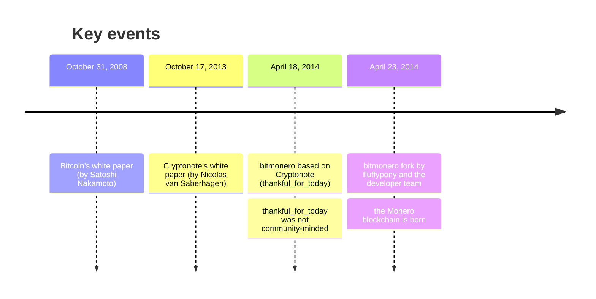
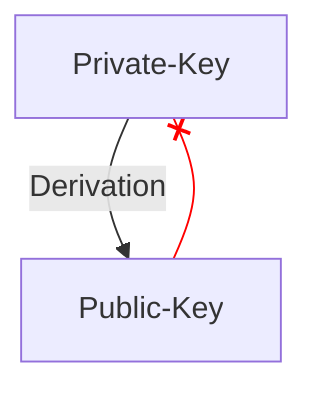

+++
title = "The power of mathematics: a dive into Monero"
date = 2023-11-26T17:57:56+01:00
author = "Mijux"
keywords = ["math", "blockchain", "privacy", "security","monero"]
summary = "Monero, the privacy blockchain by design"
pin = true
draft = false
math = true 
+++

# The power of mathematics: a dive into Monero

> Disclaimer: This article does not constitute financial advice, nor is it intended to encourage the use of the Monero blockchain or the purchase of its XMR token. Please consult the legislation in force in your country. Depending on the laws and regulations, it may be considered illegal to hold Monero, or to use its ecosystem.

## Abstract

This article describes Monero, a privacy-focused blockchain far from its associations with illegal activities. It highlights its similarities to cash, through its properties of fungibility, security and confidentiality. After a short historical section, this article dives into the cryptography, based on elliptic curves, omnipresent in Monero. Cryptography, which protects users of the blockchain by masking the receiver, sender and amount of transactions. Three security elements are discussed: stealth addresses, circle signatures and confidential circle transactions, each with simplified demonstrations.

## Introduction

This article is not intended to explain how to use the Monero blockchain, how to buy XMR or how to install a wallet. You are sure to find some interesting tutorials using your favorite browser and search engine.

## Glossary

- **Monero** : The Monero open-source blockchain focused on privacy and decentralization. In this article, the term Monero will be used to designate the blockchain.
- **token XMR** : The Monero currency symbol. This term will be used to describe the monetary asset.

## Why Monero ?

In recent years, Monero has often been seen as the cryptocurrency of choice for hackers. Because of its protection and privacy features, Monero is a popular ecosystem for hackers, but also for people who simply do not want to be tracked.

Since its inception, Monero has never been about inciting cybercrime; one of its convictions is to offer an alternative to cash. You might think that is a bit strange, because our cash is physical, tangible at our fingertips, whereas Monero is a virtual cryptographic asset. So yes, with Monero you will not be able to swim in a sea of coins like our friend Scrooge...

The simplest thing, it seems to me, is to define what cash is, not by its use but by its properties. So what are its properties? I will try to define them with you.
1. be **fungible**: liquidity can be measured, counted and exchanged for other goods.
2. be **secure**: you can trust the system.
3. be **private**: with cash, only the entities involved in the payment are aware of the transaction.
4. be **scalable**: having one or thousands of transactions does not affect the system.

Monero has the same properties, making it a serious alternative to cash. It is not intended to replace the entire banking system.

Today, all our banking transactions are tracked, recorded and used. Many people take little interest in this. I am sure you have been confronted by people with this kind of attitude:
- "I have nothing to hide, so I do not care if my data is used",
- "I do not care if my bank knows what I am buying",
- or in a more accusatory tone: "do you have anything to hide?".

This reminds me a lot of Edward Snowden who said this:
> Arguing that you don't care about the right to privacy because you have nothing to hide is no different than saying you don't care about free speech because you have nothing to say.

Monero is all about privacy. It is about letting people choose how to manage their personal information: who to reveal it to, when and what. Privacy means, for example, that I can choose to whom I reveal where I live, and when. It sounds trivial, but it seems unlikely to me that you would tell a stranger in the street where you live. In monetary terms, cash respects your privacy (omitting numbered bills).

## A bit of history

A small and simple historical contextualization of the Monero blockchain in its environment, the aim not being to detail all the Monero updates.

## Cryptography: core of Monero

Monero bases all its security on mathematical proof: you don't need to trust anyone, only the mathematical proofs used to secure the blockchain! The blockchain is public, in the sense that you can read the transactions, yet you will not be able to know the sender, the recipient or the amount of the transaction!

### ECC

Monero uses asymmetric cryptography, i.e. the use of a private key and a public key. In the case of the Monero blockchain, this cryptography uses the notion of elliptic curves.

An elliptic curve is defined by the following function:
$$
y^2 = x^3 + ax + b
$$

Visually, elliptical curves have a shape similar to the image below:

### Private key
 
You have a root private key that is randomly generated. **All your other private keys are derived deterministically**, in other words, only your root private key matters, the others can be recovered by mathematical operations. This root key must remain secret (not to be put in your telephone notepad, for example).
 
This private key is 256 bits long and is a point on the elliptic curve. Monero uses the *edwards25519* elliptic curve, where the maximum scalar allowed is of the order of \\(2^{252}\\). The key strength is therefore 252 bits instead of 256. As it happens, this choice was made to comply with community standards, but is not a cause for concern for the rest of the operation.

### Public key

The public key is also derived deterministically from the private key. The principle of the public key is that it can be... public, so when correctly implemented, it is not possible to switch from the public key to the private key!

So how do you go about this derivation? Here is the equation for obtaining a public key from a private key! 
- Let \\(P\\) the public key
- Let \\(x\\) the private key
- Let \\(G\\) a constant specific to the curve *edwards25519* which is a point on the curve
$$
P = xG
$$

And that is *all*, the public key is the \\(G\\) point multiplied by \\(x\\) the private key. The result is also a point on the curve, one of the properties of elliptic curves. In the world of elliptic curves, it is not possible to find \\(x\\) from \\(P\\) and \\(G\\). We're facing the discrete logarithm problem!

### Key pairs

On the Monero system, you have several pairs of private/public keys. They are called "Spend keys" and "View keys", and as their name suggests, one pair is used to send Moneros and the other is used to see what transactions are at your destination.

## Monero security

The following sections deal with the mathematics used in Monero. The details of the demonstrations will not be explained, but you will see the mathematical equations and properties that follow from these demonstrations. This section is dedicated to understanding how the Monero blockchain protects its users' information.

Here, we will look at the three main security features of the Monero blockchain. These are: 
- Stealth Addresses
- Ring Signature
- Ring CT - Ring Confidential Transactions

| ↙ |Stealth Address|Ring Signature|Ring CT|
| ---:|:--------------|:-------------|:------|
|Protects|the sender|the receiver|the amount|

For the explanations, we will take Greg and Lola (a change from Bob and Alice), with Greg as the sender and Lola as the receiver.

### Definitions

First, to help you understand the mathematical equations, we need to give you the parameters.

#### Parameters

\\(q\\) : A prime number; \\(q = 2^{255} - 19\\)

\\(d\\) : An element of \\(\Bbb{F}_q\\); \\(d = -121665/121666\\)

\\(E\\) : The equation of an elliptic curve; \\(-x^2 + y^2 = 1 + dx^2y^2\\)

\\(G\\) : The base point; \\(G = (x, -4/5)\\)

\\(l\\) : a prime order of the base point; \\(l = 2^{252} + 2774231...493\\) [\\(_i\\)](https://monerodocs.org/cryptography/asymmetric/edwards25519/#prime-order-of-the-base-point-l)

\\(H_s\\) : A cryptographic hash function; \\(\\{0,1\\}^* \rightarrow \Bbb{F}_q\\)

\\(H_p\\) : A deterministic hash function \\(E(\Bbb{F}_q) \rightarrow E(\Bbb{F}_q)\\)

With our equation parameters now defined, we still have a few terms to define to make sure we're talking about the same things.

#### Terminology

- **elliptic private key** is a standard elliptic private key: a number \\(a \in [1, l-1]\\)
- **elliptic public key** is a standard elliptic public key: a point \\(A = aG\\)
- **one-time key pair** is an elliptical private and public key pair
- **user private key** is a pair \\((a,b)\\) of two elliptical private keys
- **tracking key** is a pair \\((a,B)\\) of an elliptical private and public key where \\(B = bG\\) and \\(a \neq b\\)
- **user public key** is a pair \\((A,B)\\) of two elliptic public keys derived from \\((a,b)\\)
- **standard address** is a representation of a user public key given in a string with error correction.
- **truncated address** is a representation of the second half (point B) of a user public key given in a string with error correction.

### Stealth Address

Here are the steps involved in a transaction between Greg and Lola.

#### Step 1

Greg wants to send XMRs to Lola. Lola has published her standard address. Greg unpack the address and retrieves Lola's public address \\((A,B)\\).

#### Step 2

Greg generates a random number \\(r\\) in \\([1, l-1]\\) and calculates the one-time public key.

$$
P = H_s(rA)G + B
$$

#### Step 3

Greg then uses the public key \\(P\\) as destination key for output. In addition, computes \\(R\\), which it puts into the transaction.

$$
R = rG
$$

We can note that Greg can create other outputs with unique public keys: Receiver keys \\((A_i,B_i)\\) involve different \\(P_i\\) even with the same \\(r\\).

#### Step 4

Greg sends XMR. 

#### Step 5

Lola checks all transactions with her private key \\((a,b)\\), and computes the next \\(P'\\):

$$
P' = H_s(aR)G + B
$$

If Greg's transaction for Lola is among the verified transactions, then :

$$
aR = arG = rA \\\
and \\\
P' = P
$$

#### Step 6

Lola can find the one-time private key \\(x\\) :

$$
x = H_s(aR) + b \\\
so \\\
P = xG
$$

This in turn enables the recipient to send the XMR tokens it has received. This mathematical process protects the recipient. No one except Lola can determine which transfers are destined for her wallet.

### Ring Signature

Another interesting feature of Monero and its Cryptonote protocol is the ability to hide the sender of a transaction. A one-time ring signature uses four algorithms:
- **GEN**: Takes public parameters and produces a key pair \\((P,x)\\) and a public key \\(I\\).
- **SIG**: Takes a message \\(m\\), a set \\(S'\\) of public keys \\(\\{P_i\\}_{i \neq s}\\) and a pair \\((P_s, x_s)\\). Then, it outputs a signature \\(\sigma\\) and a set \\(S = S' \cup \\{P_s\\}\\)
- **VER**: Takes a message \\(m\\), a set \\(S\\), a signature \\(\sigma\\) and outputs "true" or "false".
- **LNK**: Takes a set \\(\mathcal{I} = \\{I_i\\}\\), a signature \\(\sigma\\) and outputs "linked” or “indep”.

The idea behind the protocol is quite simple: a user produces a signature that can be verified by a set of public keys, rather than by a single public key. The identity of the signatory is indistinguishable from other users whose public keys are part of the set.

#### GEN

The signer generates a secret random number \\(x \in [1, l-1]\\) and computes the respective public key \\(P = xG\\). He computes another key \\(I = xH_p(P)\\). This key \\(I\\) is called "key image".

#### SIG

The signatory generates a one-time signature with a non-interactive zero-knowledge proof. This generation is based on the work of Ronald Cramer, Ivan Damgard and Berry Schoenmakers: *Proofs of Partial Knowledge and Simplified Design of Witness Hiding Protocols*.

This signer selects a random subset \\(S'\\) of \\(n\\) from the other users' public keys \\(P_i\\), his own keypair \\((x, P)\\) and the key image (generated here [GEN](#gen)).

Let \\(0<=s<=n\\) be signer's secret index in \\(S\\), his public key is \\(P_s\\). Then, the signer generates random numbers.
$$
 \\{q_i | i=0...n\\} \in (1...l) \\\
 \\{w_i | i=0...n, i \neq s \\} \in (1...l)
$$

After generating these random numbers, he applies the following transformations.

$$
L_i = \left\\{
    \begin{array}{ll}
        q_iG & if \: i = s \\\
        q_iG + w_iP_i & if \: i \neq s
    \end{array}
\right.
$$

$$
R_i = \left\\{
    \begin{array}{ll}
        q_iH_p(P_i) & if \: i = s \\\
        q_iH_p(P_i) + w_iI & if \: i \neq s
    \end{array}
\right.
$$

The next step is to retrieve the non-interactive challenge!

$$
c = H_s(m,L_1,...,L_n,R_1,...,R_n)
$$

All this allows the signer to compute the answer:

$$
c_i = \left\\{
    \begin{array}{ll}
        w_i & if \: i \neq s \\\
        c - \displaystyle\sum_{i=0}^nc_i \mod l & if \: i = s
    \end{array}
\right.
$$

$$
r_i = \left\\{
    \begin{array}{ll}
        q_i & if \: i \neq s \\\
        q_s - c_sx \mod l & if \: i = s
    \end{array}
\right.
$$

The resulting signature is as follows:

$$
\sigma = (I, c_1,..., c_n, r_1,..., r_n)
$$

##### VER

The verifier checks the signature by applying the inverse transformations.
$$
\left\\{
    \begin{array}{ll}
        L'_i = r_iG + c_iP_i \\\
		R'_i = r_iH_p(P_i) + c_iI
    \end{array}
\right.
$$

Finally, it verifies the following equality:
$$
\displaystyle\sum_{i=0}^nc_i = H_s(m,L'_0,...,L'_n, \\\
R'_0,...,R'_n) \mod l
$$

If this equality is verified, then the verifier can move on to the [LNK](#lnk) step, otherwise it rejects the signature.

#### LNK

The verifier looks to see if the key \\(I\\) has already been used in previous signatures. Several uses imply that two signatures have been produced from the same secret key.

- By applying L-transformations, the signer proves that he knows a \\(x\\) such as \\(P_i = xG\\).
- To make this proof non-repeatable, the image key \\(I = xH_p(P)\\) is used. The signer uses the same coefficients \\((r_i,c_i)\\) to prove a similar assertion: He knows an \\(x\\) that verifies \\(H_p(P_i) = Ix^{-1}\\). 

If the mapping \\(x \rightarrow I\\) is an injection then:
- No one can recover the public key from the image key or identify the signatory
- The signatory cannot produce two signatures with different \\(I\\) and with same \\(x\\)

You will find lots more information and details in *Nicolas van Saberhagen*'s work in **CryptoNote v 2.0**.

### Ring CT

The Ring CT protocol was implemented in January 2017 and became mandatory after September 2017. The protocol uses the MLSAG (**Multilayered Linkable Spontaneous Anonymous Group**) signature. This signature is similar to LSAG (**Linkable Spontaneous Anonymous Group**) signatures used in [Ring Signature](#ring-signature) but instead of having a ring signature on a set of \\(n\\) keys, it is based on a set of \\(n\\) key vectors.

- **key vector** : a collection of \\(\text{\\={y}} = (y_1, ... ,y_r)\\) public keys with their associated private key associated \\(\text{\\={x}} = (x_1, ..., x_r)\\)

As part of the Ring CT protocol, it is necessary to change the ring signature slightly to allow the use of key vectors instead of simple keys. I won't go into detail about the well-written mathematical demonstrations in *Shen Noether's* paper. In this article, it is just important to understand that despite the modification of the ring signature, it still possesses its properties of *unforgeability*, *linkability*, and *signer ambiguity*, which therefore doesn't invalidate the [previous](#ring-signature) explanation of the ring signature.

#### The sender

The sender defines the amount : \\(b =  b_02^0 + b_12^1 + ... + b_n2^n\\), then computes a new pair of public/private keys and also the corresponding \\(ss\\) shared secret ECDH (Elliptic Curve Diffie-Hellman).

Here is the public information visible in the transaction:
- \\(C_j = a_jG + (b_j2^j)H\\) where \\(a_i\\) are random numbers for \\(j = 0, ... ,n\\)
- The data \\(\\{(L^i_1,s^j_2),s\\}\\)
- The public key and \\(a+ ss \mod l\\) where \\(a = a_0 + .... + a_n\\)
 
#### The receiver

- Computes shared secret \\(ss\\) and \\(a\\) from \\(a + ss \mod l\\)
- Computes \\(C = \displaystyle\sum Ci\\), computes \\(C - aG = bH\\) and finds \\(b\\) by comparing all \\(bH\\) in the range \\([0,2n]\\)

When the recipient finds \\(b\\), he has recovered the amount sent to him. Only the sender and receiver can know the exact amount that was sent!

## Conclusion

Monero is an interesting blockchain thanks to its mathematical properties, which allow users to stay anonymous.  Please note that the protocols presented in this article are not set in stone and are subject to change. A number of discussions are underway to improve security and privacy, particularly with regard to circle signatures. This article was a real challenge for me: it wasn't easy to analyze these white papers dealing with the mathematics of elliptic curves.

Of course, not all aspects of the Monero blockchain could be discussed. In particular, the fight against ASIC through the use of their mining algorithm: RandomX. The Monero community advocates the "One CPU, One Vote" philosophy, allowing anyone to mine with a single CPU. You'll find some resources on this subject in the "[To find out more](#to-find-out-more)" section.

If you see any errors or inaccuracies in this article, I'd be grateful if you'd send me an e-mail.

## To find out more

Below are the references I consulted when writing this article. You'll be able to delve deeper.

- Nicolas van Saberhagen. **CryptoNote v 2.0**. [link](https://web.archive.org/web/20201028121818/https://cryptonote.org/whitepaper.pdf), 2013
- Sen Noether. **Ring Signature Confidential Transactions for Monero**. [link](https://eprint.iacr.org/2015/1098), 2015
- Ronald Cramer, Ivan Damgard, et Berry Schoenmakers. **Proofs of partial knowledge and simplified design of witness hiding protocols**. Dans *CRYPTO*, 1994.
- qertoip. **Documentation Non-Officielle de Monero**, [link](https://monerodocs.org/)
- davidlatapie. 	**History of Monero**. [link](https://forum.getmonero.org/20/general-discussion/211/history-of-monero)
- Marie-Line Chabanol. **Cryptographie asymétrique et courbes elliptiques**. [link](https://culturemath.ens.fr/thematiques/lycee/cryptographie-asymetrique-et-courbes-elliptiques)
- journal du coin. **ASIC**. [link](https://journalducoin.com/lexique/asic/)
- Monero. **RandomX**. [link](https://www.getmonero.org/fr/resources/moneropedia/randomx.html)